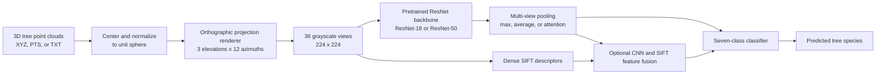

# Tree Species Classification from 3D Point Clouds

## Project Overview

This project classifies tree species from 3D point-cloud data by transforming each tree into a set of 2D orthographic views and learning from those views with deep-learning models.

The implementation works with 691 point-cloud samples across seven tree species. It normalizes each point cloud, renders multiple grayscale projections from different angles, and uses multi-view ResNet models to aggregate visual information into a final species prediction. An experimental feature-fusion path combines CNN representations with Dense SIFT descriptors.

The supported species are Buche, Douglasie, Eiche, Esche, Fichte, Kiefer, and Roteiche.

## Architecture

The project treats each tree as a 3D object rather than a single image. Multi-view rendering preserves information from different viewpoints, while view pooling or feature fusion combines those perspectives before classification.

## Technology Stack

| Project Component | Technologies | Purpose |
| --- | --- | --- |
| Point-cloud processing | Python, NumPy, SciPy | Read XYZ, PTS, and TXT point clouds, center them, scale them to a unit sphere, and create normalized 3D inputs. |
| Multi-view rendering | NumPy, SciPy, Pillow | Produce 36 grayscale orthographic projections per tree from three elevation angles and twelve azimuth angles. |
| Deep learning | PyTorch, Torchvision, ResNet-18, ResNet-50 | Support multi-view classifiers with backbones adapted for single-channel rendered views, including ImageNet initialization in the ResNet-50 fine-tuning path. |
| Multi-view learning | Max pooling, average pooling, attention pooling | Aggregate feature representations across all rendered views of the same tree. |
| Feature fusion | OpenCV, Dense SIFT | Extract classical descriptors from rendered views and combine them with CNN features in the experimental fusion model. |
| Evaluation and analysis | Scikit-learn, Pandas, Matplotlib, Seaborn | Create dataset summaries, calculate classification metrics, and visualize training and evaluation outputs. |
| Compute acceleration | CUDA-enabled PyTorch, CuPy | Use GPU acceleration when available, with CPU-compatible processing paths. |

## Data Flow

1. Tree point-cloud files in XYZ, PTS, or TXT format are loaded by species.
2. Each point cloud is centered and scaled to a unit sphere to normalize its spatial representation.
3. The normalized cloud is rotated across three elevation angles and twelve azimuth angles.
4. Thirty-six 224 x 224 grayscale orthographic projections are created for every tree.
5. A ResNet-18 or ResNet-50 backbone extracts features from every rendered view.
6. Max, average, or attention pooling combines the multi-view CNN features into a single tree-level representation.
7. The experimental fusion route extracts Dense SIFT descriptors and combines them with CNN features before classification.
8. The final classifier predicts one of the seven supported tree species.

## Implementation Scope

- 691 point-cloud samples are used in the current training setup.
- The recorded run uses a 553-sample training split and a 138-sample validation split.
- ResNet-18 and ResNet-50 implementations are available for multi-view classification.
- The ResNet-50 fine-tuning route supports ImageNet initialization and attention-based view pooling.
- The feature-fusion route combines 2,048-dimensional CNN features with 128-dimensional Dense SIFT descriptors.
- Dataset analysis, species-specific visualization, data splitting, model training, and evaluation utilities are included.
